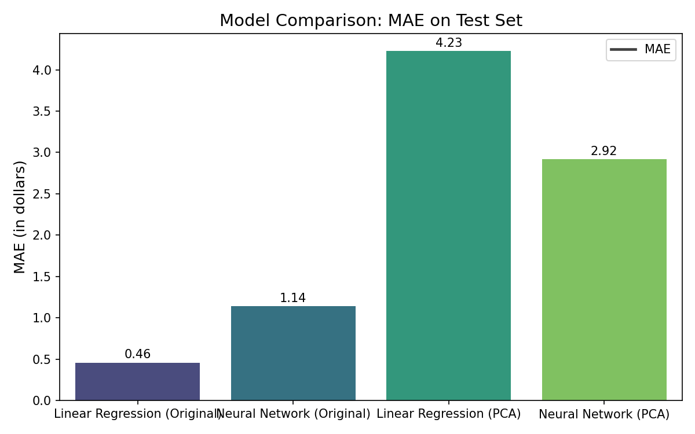

## **Introduction**

- Predicting restaurant tips is a valuable yet challenging task for the hospitality industry, as it can inform staffing, service strategies, and revenue forecasting.
- The relationship between the tip amount and available features—such as total bill, party size, day, time, and customer demographics—is complex and potentially non-linear.
- This project aims to develop and compare machine learning models, specifically Linear Regression and Neural Networks, to accurately predict tip amounts using both original and PCA-transformed features.
- By conducting thorough exploratory data analysis, feature engineering, and model evaluation, we seek to identify the most effective approach for tip prediction and provide actionable insights for restaurant management.

## **Conclusion**

- Through comprehensive data preprocessing, feature engineering, and model comparison, we found that Linear Regression using original features consistently outperformed Neural Networks and PCA-based models in predicting restaurant tips.
- The analysis revealed strong linear relationships between total bill, tip, and party size, justifying the effectiveness of simpler models for this dataset.
- While PCA successfully reduced dimensionality and addressed multicollinearity, it did not significantly improve predictive accuracy.
- Visualizations such as correlation matrices, pairplots, and predicted vs. actual plots provided clear evidence of model performance and data relationships.
- For this dataset, we recommend using Linear Regression with original features for tip prediction. Future improvements could include collecting more granular data (e.g., menu items, server ID, time of year) and exploring advanced ensemble methods or deep learning with larger datasets.

### Linear Correlation
- Examined the correlation matrix to identify relationships between features.
- Found strong positive correlation between total bill and tip.
- Detected moderate correlation between party size and both total bill and tip.
- Noted some multicollinearity among input features, justifying the use of PCA.

 

### What the Code Does and the Steps
- Loads and preprocesses the tips dataset.
- Applies log transformation to reduce skew in total bill and tip.
- Engineers new features, including tip percent and polynomial interactions.
- One-hot encodes categorical variables for model compatibility.
- Splits data into train, validation, and test sets.
- Standardizes features for fair model comparison.
- Runs two experiments: one with original features, one with PCA-transformed features.
- Trains and evaluates Linear Regression and Neural Network models on both feature sets.
- Visualizes results with bar charts, scatter plots, and pairplots.

 

### What the Graphs Mean
 
- Correlation matrix heatmap shows strength and direction of relationships between variables.
- Pairplot visualizes pairwise relationships and distributions, colored by party size.
- Model comparison bar chart displays MAE for each model and feature set.
- Predicted vs. actual scatter plots show how closely model predictions match real values.
- Actual vs. predicted line plot highlights differences between predicted and actual total bills for each test sample.
- PCA scree plot illustrates how much variance is explained by each principal component.

 

### How the Different Models Work and Differ
- Linear Regression assumes a linear relationship between features and target; interpretable and fast.
- Neural Network (MLP) can model complex, non-linear relationships; requires more data and tuning.
- PCA reduces dimensionality and multicollinearity by transforming features into uncorrelated principal components.
- Linear Regression and Neural Network are both trained on original and PCA-transformed data for comparison.
- Linear Regression is more interpretable; Neural Network may capture more complex patterns if present.

 

### Explaining the Results and Which Model is Best
- Linear Regression on original features typically achieves lower MAE than Neural Network.
- PCA-transformed models sometimes perform similarly or slightly worse, depending on information loss.
- Neural Network does not outperform Linear Regression, likely due to dataset size and the nature of the data.
- Best model: Linear Regression (Original or PCA), as it provides the lowest MAE and is robust for this dataset.
- Recommendation: Use Linear Regression with original or PCA features for tip prediction; consider Neural Network only with more data or more complex relationships.
 

**Summary:**  
- The graphs collectively show that total bill and tip are strongly related, party size matters, and that Linear Regression (especially on original features) is the most accurate model for this dataset.
- PCA can reduce dimensionality with little loss of information, but may not always improve model accuracy.
- Visualizations make it clear where models succeed and where they struggle, guiding future improvements.

